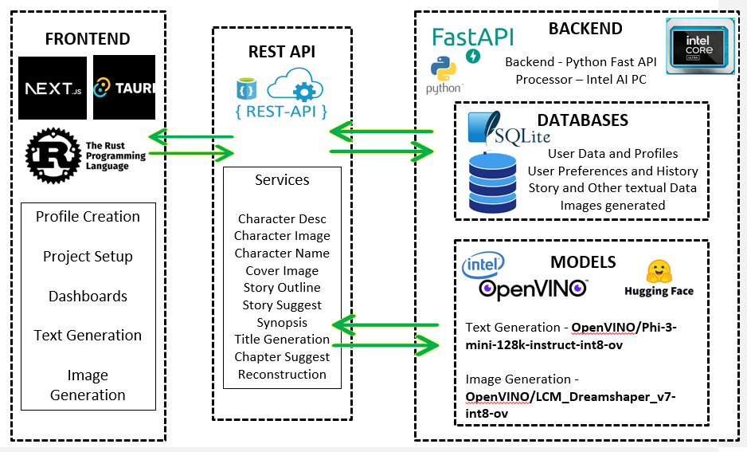
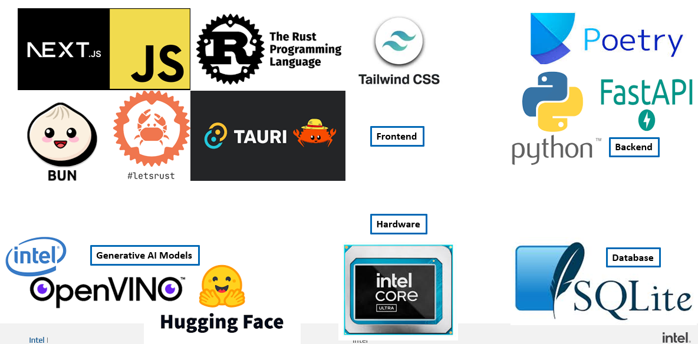

<div style="text-align: center;">
       
    &nbsp;&nbsp;&nbsp;&nbsp;&nbsp;&nbsp;&nbsp;&nbsp;&nbsp;&nbsp;
       <img src="data:image/jpeg;base64,/9j/4AAQSkZJRgABAQAAAQABAAD/2wCEAAkGBxIQEhUQEBIVFRUXFRUVEBUVFRUVFRUVFRYXFhUVFRUYHiggGBolGxUVITEhJSkrLi4uFx8zODMtNygtLisBCgoKDg0OGBAQGisdHyUtLy0rKy0tLS0tLS8tLy0tLS0uLS0tLS0rLS0tLS0tLS0tLS0tLS0tLS0tLSstLS0tLf/AABEIAOEA4QMBEQACEQEDEQH/xAAbAAABBQEBAAAAAAAAAAAAAAAAAQIDBAYHBf/EAEYQAAECAgUGCQcMAgIDAAAAAAEAAgMRBBIhMVEFBhNBcbIUMlJhc4GRobEHFSI0cpLRIyQzQlNUYmOCk8HCg/Cz4RZDov/EABoBAQACAwEAAAAAAAAAAAAAAAABBQIEBgP/xAA1EQACAQEEBQsEAwEBAQAAAAAAAQIDBAURcRIyM1KRExQhMTRBUYGxwdEiI2FyoeHwQmIk/9oADAMBAAIRAxEAPwDuKApxbygJ6Nd1oBtK1daAZR70BYiXHYUBTQF4ICnFvKAmo13WgEpOpAMgcZAWH3HYUBTQF1tyAqxuMf8AdSAlo1x2oApNwQEUDjD/AHUgLTrigKSAuMuGxAVo/GKAlo1xQBSbutARQeMEBaKApIAQDtIcUBYYwEAkICKMZGQsQDoPpTnagFitAExYgImvJIBKAsaMYICtpDigJ4bARMhARxjVMhZYgFg+lOdqAfFaAJixAQteSQJoCxoxggK5iHFATQ2giZFqAZGNU2WIAgmtfagHxWgCYsKAhEQ4oCxoxggK7nmd6AmhNBEzaUAyN6N1iAIJrGRtQD4jQBMBAQiIcUBY0YwQBoxggG6Ac6AjMUiwakA5ja9pQA/0LteKARr61hQEVIpEGFx4jWnUHOaO5Zxpzl1Js851qcNaSWbIPPUL7WH2hZchU3WefO6G+uIecaN9s3tTkKm6xzuhvoPPEEWCKyWq1OQqbrI55Q31xDzrAda6K2e1OQqbrHPKG+uIHK0BvFit55lOQqbrHPbPvriHniCbHRWS2pyFTdY55Z99cQ85UYWiK3tU8hU3WOe2ffXETz1C+1Z2qOQqbrHPLPvriL5yo32re1TyFTdY57Z99cQ88QRYIrJarVHIVN1jnln31xAZVgO40Vs+YqeQqbrHPLPvriHnWA3ixW9ZUchU3WOeUN9cQ88QTYYrJa7U5Cpusc8ob64h5yo32re1TyFTdY57Z99cQ89QvtWdqjkKm6yed0N9DvOFHN8Zk/aCcjU3WOd0N9cUPhU+G6yHEY7CTgT2ArGVOcetNHpCtTnqyTyaLDBXv1LA9Ae2paNlqAa2IXWHWgJNAOdARac8yAXTnmQDuEc3egE0Va2d6AWtUsv1oCnlTKUOCzSRTVAsaBaXE6gF6UqUqstGJ4Wi0QoQ05v+zC5TzljRiQ0mGzktMnEfieLeySuKNjp0+l9L/wB3HNWm861Z4R+mPguvzfweSI7tRl1fytrRRo6bF4S/lHuUaKJ5SfiHCX8rwTRQ5SfiHCX8o9yaKHKT8Q4S/lHuTQQ5SfiHCX8o9yaCHKS8Q4S/lHuTQQ5SfiHCX8o9yaCHKT8Q4S/lFNBDlJ+IcJfyj3JoIcpPxDhL+Ue5NBDlJ+IcJfyj3JoIcpPxDhD+Ue5NBDlJ+IcJfyj3JoIcpPxDhD+Ue5NFDlJ+IcJfyj3JoocpLxE4S/lHuTRQ5SfiPbTH65HaFHJoyVaXf0nu5HzmiQyGzmNbHkkfpde3vC1K1jjLp9PjvLGy3jOGCxx/D9n3fyjZ0GnspLZsMpcYG9pwI/lVVSlKm8GdBQtEK0cY+a70WNFV9Kdy8z2F0/N3oBOD8/cgF4Pz9yAZoCgJGxABI6kBBTYzWtdFcZNa0lxOAtWUYuTUV1sxnNQi5S6kcwyrlF9JiGI6wXMbqY3UNuJxXQUKMaUNFef5ONtVplaKjnLq7l4L/dZTXqa4qAEAIAQAgBACAEAIAQAgBACAEAIAQAgEQAgPVyJlR8F4c28aibHN1sP8c6169GM44P8A35NyyWmVKaa6/VeHwdJgUtsZjXMMw4At+B51RTi4ScX3HW06kakFOPUwEErEzJdOEAacIB9cYjtQFaI0kkgIDLZ+00thQ6OP/Y4ud7MOUu1xHulWN3U8Zufh7lPfNXRpKmu9+hi1bHNCoSCAEAIAQgEJBACEAgBACEghAIAQkEAIAQAgEQgEJAIDc5jU2sHwz9Uh45g6xw2VhP8AUqi308GpeXA6O562lGUPDp49f8rHzNYXjEKvLkq1DgUAtQ4HsQDUBbhXDYgOeeUB5NLa3UILSOtz5+AVzd6+08znL6f3Yr8GeW8UwIAQCIQCkCoAQAgBACAEAIAQAgBQAUgRACgCoAQkEAiA0OY7pUhwxhO3mH+FpXgvtLP5LS5n/wDS/wBX6o3IVKdQXkAIBJICpFvKA5/nv623oW70RXN37J5/Bzd9bWOXueIt4pwQAgBCAQApAIAQAgBACAEAKACkAgBQAQAgBACEggBAaHMP1r/G/wAWrSvDY+fyWdz9pf6v1R0UhUp1JSmgCaAdpTigJ2MBAJCA53n6JUwS+xZvRFdXfsnn8HNXzto5fJ4K3SoBACAEIBACkAgBACgApAIAQAoAKQCAEAIAQAgBQSCAEB7+Y5+cnon+LVpXhsfP5LO5+1P9X6o3oiHFUp1JY0QwQBohggGcHHOgGGKW2CViA59n0+dLHQt3nq5u/ZPP4ObvnaxyPCW8U4IAQAhAIAUgEAIAQAgBACAEAIAQAgBQAQAgBCQQAgNBmKJ0oj8p/i1aV4bFZ/JZ3P2p/q/VHQdAOdUp1IzhB5kAcIPMgHcI5kAmirWzvQHPc+mypYH5LN56urv2Tz+Dmr5f3or8fJ4S3SoBAIVJDBCAQkVCAQAgBAIhAIBUMgQAoAIAUkCIAQBJACEiqACEmgzFMqUT+U/xatK8Nj5/JZ3P2p/q/VHQNPzKlOpE4PzoA4PzoBuhdggJWxABI6kBzvPwzpgI+xZvPV1d+yefwc1fO2WXuzwVulQCEFrJzQS6YBsF4WM30GvXbWBedDbI+iOwLyTZ4KT8Txgtg3xUAIAQAhA1ylEPqN0zNKjkAziXD6ww2Kld4Vce46hXNZ8O/iZ3OXJrKNEayGXSLA41jO2s4fwFv2StKrBuXiVF42WFnqqMMcGsenNnkrZNAFIBQAUkCIAQHSM2vVYPsf2K5+17aeZ2V3dlp5HkZ+8SD7b90Lau3WlkaF97OGfsY9WpzoISe/mOJ0kj8p/i1aV4bHz+SzuftT/V+qN8IJVKdSTaZuKANM3FAOrjEdqArRGkk2IDn2fNlKb0Ld56ubv2Tz+Dmr620cvdnhFy3ioGl6kglotLqE2Tnzy/hRKOJ51IaRb84z+r/wDX/Sw5M81Q/JSXobAIAQBNAIXIBrnWKV1mMupnW4fFGweC5d9bO+j1IxefX0zOiG+9W93bN5+yOavrbx/X3ZnFvlQCkCEoBKyAaXJgBtZTgQdMzZ9Ug+x/YrnrXtp5nZXf2WnkeTn7xIPtv3Qtq7daWRoX5s4Z+xj1anOghJocxPWv8T/Fq0rw2Pmvcs7n7S/1fqjoheMQqU6kqVDgexAFQ4HsQCIC3CuGxAc48oPrg6Fm9EV1d+yefwczfO2WXuzOEreKkYVINBmZQIUeJEbFZWAYCASRI1palpW6rOnGLg8OktLqs9OtOaqLHBI1FKzeorWPIgiYY4i194aSNaroWus5JaXeXFS7rMoNqC6mZzM+gw473iK2sAwETJFs5alYW6rOnFOLw6SlumhTrTmqixwSNLSM3aNUdVgitVdV9J3GkZa8ZKvjbKuksZdBdTu2z6L0YLHDoKuSc1IUNoMcaR8rR9RvMB9baV6VrfOTwh9K/k8LLdFKEU6v1S/j+z1HZHoxEuDwv22g9oE1rc4q774m87HZ2sOTjwR4mWc0WOBfRvRcLahM2u5gTxT3bFuULfJPCp0rxK613RCScqPQ/Dufx6GGiAiYIkRMEawReFcLpOckmsUzsELijYPBcs+tneR6kVabkuDGIdFYHECQJJFkydRxJXpTr1Kawi8DwrWSjWkpVI4sw+dFEZBjlkNtVtRhlMm0znermx1JTpaUni8WczeVKFK0aMFgsF7j8hZvvpPpuNSHPjSmXSvDR/J71FptcaX0rpfpmZWK7p2j6n9MfHveXyayj5u0Vglomu53+mT22dgVXO11pf8AWGXQX1O7bNBaiefSSxch0V18CGPZaG7sljG01l/0/UzlYbNLrpryWHoZrLeaBaDEoxLgLTDNrpfgOvYbdq37PeGL0anR+fkqbXdGinOj0/j4MlNWhSHTs2PVIPsf2K5217aeZ2F39mp5HlZ+8SD7b90Lau3WlkaF97OGfsY9WpzqBCT38yPWT0T95q0rw2Pn8lnc/an+r9UboKlOpLyAEAlUYICrENpQHPM+vWh0LN56uru2Tz+Dm752scjPkrfKcYShOBqfJ6flYvRjeCrry1I5l1cqwqTyXqbOm/RxOjfulVVPXWaL6rqSyfoY7yeunEi9G3eVreerHM56419c8l6m4VOdIY7LeeDmPMOjhsmkhz3AmZF9UTu5yrSz2BOKlU4FFa72lGbhRS6O9+xHkjPJ5eGUgNqkgV2gtLZ2TInIjsWVe74qLdN9PgY2W9puajWSwfeu42qqS/OdZ9UYQ6QXC6IwP/UJtd4A9avbvnpUsH3PA5a96KhWcl/0sfPqZ0KFxRsHgqN9bOoXUjP5y5wRKLEaxjWEOYHekHTnWcNRFlgW9ZLJCtByk31lTeF4VLNUUYpNNY9OPi/yZ2FEdlClMrgNmBXqzkGMtJtJtlZ1hb7UbLReHT4ZsqIuVvtUdJYeOHgv9gdDYwNAa0BrQJACwAD+FRNtvFnWpKKwXQkYzKuejqxbRmtqiYrvBJdztExIbZ9StaN3LDGo+nwRQWm95aWFFLDxffkV6HnpGaflWse3XIVXdRnLtCznd1Nr6W0+J5Ur4rRf1pNcGbeh0psVjYkMza4TB17CNRBsVRODhJxl1o6KnUjUgpx6mYTPfJohRhFYJNizJGoPHG7Zg9qubBWc4aL616HO3rZlTqKceqXr/Zrc1/VIHsf2KrLXtp5lzYOzU8jys/eJB9t+6FtXbrSyNC+9nDP2MerU50EBocw/Wv8AE/xatK8Nis/ktLm7S/1fqjohaMFSnUlOZxQBMoB+mdj4ICZkMETItQHOfKC2VLEvsWbz1dXdsnn8HNXztll7szRK3ypRG4oZpGp8nJ+WjdG3fVdeWpHMubn2k8l6m1p5lCiH8t+6VVU+mcc0XdV4U5N+D9DFeTh3ysXo27ytbz1I5lHcqwnPJG5pLy1j3C8McRtDSVUxWMki+m8Ito4u19g2LqGcSl0COfYetEGug7PQ3ThsJvLGE9bQuXmsJNfk7aDxin+EYnykn04XRv3gra7NWWaKC+teGT9TcwuK3YPBVD62dAupGE8oLvnEPoRvvVxduzln7I56+V92OXux3k+AMeIdYhSHW9s/AKLyf24r8+xFzRXKzf49X/RuokMOBa4TBBDgbiCJEHqVQm08UdFKKkmn0pnnf+PUT7tD91e3Oq2+zW5lZ9xcBRm/RPu0L3U51W32OZWfcXAuUWjMhNqQ2hjZk1WiQmb15TnKbxk8We8KcYLRisEZ3ygtHB4Z1iMAOuHEn4Bb12v7rX490Vd8r7MX/wCvZnp5reqQPY/sVr2vbTzNywdmp5Hl5+8SD7b90Lau3WlkV997OGfsY9WpzwID38xzKkk/lP8AFq0rw2Pn8lnc/an+r9Ub0RTj4KlOpJ9C3BAGhbggG8HGJQDTFLbMEBzrP986UD+Szeerq7tk8/g5u+drHIzZW+VKIXlDM1Pk2+mjdG3fVdeepHMuLn155L1Nrlf1eN0MXccqujtI5r1Lqvsp5P0MX5NT8rF6Nu8rS89SOZS3PrzyXqbmm/RxOjfulVMNZZl7PVeRxRpsGwLqWcWhj3WHYiJaO20H6KH0bN0Llp6zzOzhqrJGI8pf0kHo37ytrs1ZZoor5X1wyZuKHED4bHC5zGOGwtBVTNYSafiXlOSlFNd6Rkc/slRor4cWFDc8BlRwYC5wIcXA1RbL0j2Kyu+tCCcZPDv6SpvSz1JuM4LHu6Dxs0KSaNTGtitcyu0wyHtLSC4gtmCOU0CfOtm2RVWi3Hpw6eg07vk6NoSmsMVh0/wdLiMmC2ZEwRMWETEpg6iqNPB4nSNYrA5lluPlGiPLXxoxb9SICajht1GV4KvKMbNVjiorHwOdtErXRk05PDxKdEyzTopDYUWO84MLndsrl6zoWeCxlFI8YWm1TeEJSeRoaXk3KcOEIvCHvdaYkNriXNHNy+cDqmtOFWySno6KS7n/ALqN6pQt0KekptvvS/3SZyPlONGFWLFe8AzAcZiYmJ7bT2rfjRpweMUkVFW0VaiwnJs6Rmt6pA9j+xVFa9tPM6ewdmp5HlZ/cSD7b90Lau3WlkV997OGfsZBWpzwIDQZiidKl+U/xatK8Nj5/JZ3P2l/q/VHQdAMSqU6kZwg4BAHCDgEA/hAwQDTCrW4oDnWf7JUodC3eerq7tk8/g5y+drHIzLlvlSiGIVJmjVeTT6aN0bd9Vt56kcy4ufXnkvU22WB83j9DF/43Kro7SOa9S6r7KWT9DFeTP6WL0Td4K0vPUjmUtz688kbqnD5KJ0b90qphrLMvJ6ryZxMXBdScWiKJciMjuFA+ih9GzdC5aprvNnY09SOSMP5Sz8rB6N+8FbXZqSzKS+NeGTPSzHy/DfCbRojg2Iz0YczKuz6tXnAslgAte3WaUZupFdD6/wbV3WuMqapyeDXV+Ua1V5aHMPKG6VMPRw5Y61e3fsfNnO3p2jyRos1M72RmiFSHBsUWBxkGxMDO4Ous16sFpWqxSg9KCxXp/Rv2O3xqJRqPCXr/ZrVXlmA5kBQytliDRW1oz5H6rBa92xv8mxetKhOq8Ir4PCvaKdFYzfl3nL8pU80iK6MWNZWPFbcNp1nEroKVPk4KOOJytorctUc8MMTpea3qkD2P7FUVr208zprB2ankeVn8PQg+2/dC2rt1pZFffezhn7GPVqc8CA0GYplSifyn+LVpXhsfP5LO5+1P9X6o6DpxgqU6kbwc4oA4OcUAzQuw8EBMyIAJG9Ac38oTp0sEfYs3oiuru2Tz+Dm74X3ll7szDlvlWiCIVJkiKHSokMkw4j2EiRLHOaSL5GRtUShGWssT1hOUdVtZEoypHIIMeMQQQQYryCCJEETtCxVKmulRXBGTrVGsHJ8WFHpL4ZJhvewmw1HObMYGRtWUoRlrLEwjOUNVtZE/nOORIx42B+Vf8VjyNPdXBGTr1d58WVHL0PJEMRDIstyrSBYKRGlqGlifFefI091cEevL1d58WMj0uJEkYj3vIsBe5zpbKxsWUYRjqpIwlOUtZt5lclZGJfo+WaQwSZSIzRgIr5dk15SoUpdcVwR7K0Vo9U3xZWplLfFdXiPc90gKziXGQuEys4QjBYRWBhOcpvGTxZAsjEv0LLVJgiUKPEaOTWJb7pmF5ToUp60Uz2p2mrT1ZNFiNnPTXiRpMT9JDD2tAKwVkorqijOVttEuub9PQoVy41nEkm8kzJ2k3r3SSWCNSTbeLJ4aGLL8HKEZoDWxorWi4CI8AbADILzdKm3i4p+SMlXqxWEZtLNkj6XEiS0kR75XV3udLZMooRjqpLJHlOrUnrybzbYikwBAe/mOJ0kj8p/i1aV4bHz+SzubtT/AFfqjeiEcPBUp1JPpm49xQBpm4+KAfWGKAqxBaUBzvP0fOm9E3eerq7tk8/g5y+NrHL3M04LfKpEMRqkyRWiMUmeIjGIQ2SVUIHNCAUtUEEURikyxIqqEj6iDEY4SQA0IBxYgxGISCAexiENk7GIYtk7GrExJWhDBk0NQzElUAEBocxPWv8AE/xatK8Nj5/JZ3N2l/q/VHRC4YqlOpKlU4IAqnBAIgLcK4IDm/lE9bHQs3nq6u7ZPP4ObvnarL3ZmSFvlUmMc1DLEifDU4kjWsQYjqiAA1APqqCBjmKSSMw0JxFDEIEdDQlMaGKRiPqKCBj4SknERsNBiSNhqCMSZrVBBIAhg2OkhiSsUEEigkEB7+ZHrJ6J+8xaV4bHz+SzuftT/V+qN0FSnUl5ACAbUGAQFaI4zNqA55n4fnQ6Fm/EV1d2yefwc5fO1jl7meIW8U6GkIZJjSFJOI2SEjpIRiJJBiLJBiBagxGlqEhJABCASqgANQBVQBVQDgEIxHgIYtjgEMR0lBA9oQkeoAIDQ5ietf4n+LVpXhsfP5LO5+1P9X6o6IWjAKlOpKlY4ntQBWOJ7UA7TOxQEzYYImb9aA535QoVWlMOowRL9LnT3grm7n9tr8nOX0vuRf4M0VYFMJJCRCEJxEkgxFkgCSAJIMQkgEkhOISQYhJBiJVQYhJBiLJBiEkGIoCGOIoCEDwFBA6SAUKCRyAEBocxQeEOI1Qnd7mAfz2LSvB/aWfyWlzL/wChv/y/VG8EU4qlOoJtC3DxQBoW4eKAbwfnQDTFq2SuQGT8olDL4UOkgfROLX+xEqifU4N7SrC7qmE3B9/sVN70dOkpru9GYZXBzIkkASUgJIAkoASQBJAEkAiE4ggxBSAkgxBBiKhASQCgKAKEIHBQSOQAEAqAEBtcwaJJj4pHHNVp/Cy8+8SOpVN4VMZKC7vc6K5qOjTlUff1ZL+zV6DnVcXQnCDggDhBwQDuEDAoBphF1o1oCOkQWuY6FEFZrgQ4YhwkVMZOLTRjKKknF9TOUZWya+iRTBfaLTCfy2av1C4hdDQrKtDSXX3nIWyySoVMO7uZVXsaYIAQAgBALJAIgCSEhJAEkASQBJCAQCyQBJAOkgFAUEioAQCoC3kjJr6VFEKHtiO1MbiefUAvKtWjSjpPy/Js2SyytE9FdXe/A6hRaIILWtaAGtEmgYLn5Scm5PrZ2MIRhFRj0JE2nHOsTIZwc8yAODnmQDdE7BATMeAJEoCOKKxmLUBUyjkuFSIZhUhswbWm5zXD6zSLivSlVlSlpRZ5VqMK0dGaxRgMq5rUijkmGNPD1Fg+UA/EzXtE1cUbdTn0S+l/wc9abqqQ6YfUv5PD0zZyNhF4NhG0G1bi6elFXKDi8GO0gxQxwYaQYoMGFcYoMGFcYoMGFcIMGFcIMArhBgxKwQYMK4QYMWuMUGAVxigwYVxigwYukGKYDBi6UYpgTgGlGKYDBhpm4pgMBNO0mQMybgLSdgRrDpYUXJ4JYnuZJzYpNIM3NMKHrc8SeR+Fnxl1rTrW2nT1fqf8cSzs91Vajxn9K/ngb3I+TYdFZUY2TdZNrnOxcdZsVPVqyqy0pHR0KEKMNCCwRee8ESF68z1IRCOCAsaVuKANK3FAOmgKkQWlAT0e7rQDaTq60AyBegFpdEhRAdJDY+z6zWu8VlGco9TwMZQjLrWJ5jsiUY30eF+234LPl6u8+J583pbq4FnzBRPu8H3G/BTy9XefEc2pbq4FaJkGizPzaF+234JzirvPiRzajuLgSQc36IRbRoN/Ib8E5xV3nxHNqO4uAkbN+iC6jQvcb8E5xV3nxHNqO4uAyFkCizto0L9tvwTnFXefEc2o7i4Ezs3qHI/NoPuNTnFXefEc2o7i4FfzDRfu0L9tvwTnFXefEc2o7i4IsjN6h/doPuNTnFXefEc2o7i4EETIFFmZUaF+234JzirvPiObUdxcEPg5v0Qi2jQfcb8E5xV3nxHNqO4uARs36ILqNB9xvwTnFXefEc2o7i4DIWQKLO2jQv22/BOcVd58RzajuLgWHZAolvzeD7jfgnL1d58SebUt1cCqMhUb7tC/bb8E5xV3nxHNqO4uBcZkOiyHzeFdyG/BRy1TefEnkKW6uA5tEhwydHDa0fhaG+AWEpSl1vEzjCMepYFqj61iZBSLutARQbwgLRKApSQBJACAtwrhsQEFJv6kA+i6+pAOpFyArw7xtCAuoCiUBbg3BAQ0m/qQC0bWgJI/FQFZl42hAXUBRdegLUDihARUm/qQC0a8oCSPxT1eKArNvG1AXUBSfedpQFmBxR/utAR0m8IBKNf1ICaNxSgKgQF5ACAooC3CuCAhpF/UgHUXX1IB1IuQEEO8bQgLiAolAW4NwQENJv6kAtG1oCSPxUBWZeNoQF1AUXXoC1A4oQEVJv6kAtGvKAkj8U/7rQFZt4QF1AUn3naUBZgcUf7rQEdJvCASjX9SAmjcUoCoEBeQAgP/2Q==" height="150" width="150" alt="Intel Logo" />

<h1>HACKSTORM: INTEL® AI PC EDITION December 2024</h1>
<h3>
<a href="https://storyforge.hashnode.dev/storyforge-revolutionizing-writing-industry-with-ai-and-intel-technology">
    Blog Page Link
</a>
&nbsp;&nbsp;&nbsp;
<a href="https://youtu.be/oX6uLK7w9MQ">
    YouTube Demo Video
</a>
&nbsp;&nbsp;&nbsp;
<a href="https://github.com/grittypuffy/storyforge">
    Github Repository Link
</a>
</h3>
<h1>StoryForge: Revolutionizing writing industry with AI and Intel® Technology</h1>
</div>

StoryForge is a client-side desktop application that leverages Intel® AI PC’s cutting-edge architecture and technologies which works offline to support novelists and writers by helping them with:
Analyzing the story for tone, emotion, structure, genres, etc.,
Generating Content – character names, descriptions, chapter suggestions, story titles, reconstructing the content based on needs, synopsis, outline, etc.,
Generating Images – character images based on description, cover image based on synopsis, etc.,

# Table of Contents

## Problem Statement

Writing a novel is a time-intensive, creative process that can overwhelm even seasoned writers.

**Challenges Include:**

* Crafting coherent narratives based on complex plots or storylines.
* Generating content that aligns with a given style, tone, or theme.
* Lack of visualization aids, such as images, which complement storytelling.
* Ensuring productivity and creativity when writer's block strikes.

There is a need for a solution that acts as a creative assistant, generating suggestions, maintaining coherence, and supplementing written content with visuals. This will empower writers to focus more on storytelling and less on repetitive or supplementary tasks.

## Solution Proposed
StoryForge is a client-side desktop application that leverages Intel® AI PC’s cutting-edge architecture and technologies which works offline to support novelists and writers by helping them by analyzing the story's tone, emotion, structure, and genre, while generating content such as character names, descriptions, chapter ideas, story titles, and synopses, along with creating visual assets like character illustrations and cover images based on the narrative.

## Architecture Diagram

<div></div>

## Technologies Used

### **Optimum Intel**  
Optimum Intel is a Python library that is specifically designed to enhance the speed and efficiency of AI workloads on Intel hardware. It optimizes the performance of AI models, particularly for tasks related to text and image generation. By integrating with popular libraries like diffusers and transformers, it facilitates the deployment of AI models directly on end-devices, ensuring that users can leverage powerful hardware capabilities for faster processing, even in resource-constrained environments.

### **Intel OpenVINO**  
Intel OpenVINO (Open Visual Inference and Neural Network Optimization) is an open-source toolkit that aims to optimize and deploy deep learning models. It is designed to maximize the performance of models on Intel hardware, enabling efficient inference, improved execution times, and optimized use of system resources. By supporting a wide range of AI models, OpenVINO helps in enhancing the productivity of AI tasks across various applications such as image recognition, object detection, and more.

### **Python**  
Python is a versatile, high-level programming language that is widely used for backend development in a variety of projects, including AI and machine learning applications. In this context, Python serves as the core language for handling API requests and interacting with AI models. It simplifies tasks related to data processing, model deployment, and communication with other components, making it an ideal choice for powering both text and image generation processes in the system.

### **FastAPI**  
FastAPI is a modern, high-performance web framework for building APIs in Python. It is designed to be fast, easy to use, and highly compatible with asynchronous programming. FastAPI powers the backend of the application, managing the flow of data between the client-side and AI models. It enables quick development of APIs with built-in validation, automatic interactive documentation, and support for asynchronous requests, ensuring efficient operation of text and image generation tasks.

### **Poetry**  
Poetry is a dependency management tool for Python that helps developers manage and maintain the libraries and packages needed for a project. It simplifies package installation, version control, and environment consistency, ensuring that all dependencies are up-to-date and compatible. Poetry also facilitates the creation of isolated environments for projects, making it easier to maintain different configurations for development, testing, and production.

### **Tauri**  
Tauri is a cross-platform framework for building lightweight, secure, and efficient desktop applications using web technologies like HTML, CSS, and JavaScript. It ensures a small application bundle size while providing offline functionality and privacy. Tauri is often used alongside Rust to handle system-level tasks that require enhanced performance. This combination allows developers to create secure and performant applications while maintaining a native feel on Windows, macOS, and Linux.

### **Rust**  
Rust is a systems programming language known for its memory safety, performance, and concurrency. It is often used to build fast and reliable system-level components, making it a perfect fit for high-performance applications. In this project, Rust works alongside Tauri to implement performance-critical tasks that require low-level system interactions. Its ability to handle concurrency and prevent memory errors makes it a preferred choice for ensuring the reliability and efficiency of the application.

### **Cargo**  
Cargo is the Rust programming language’s package manager and build system. It is responsible for managing Rust project dependencies, compiling code, and running tests. Cargo simplifies the process of building and distributing Rust applications by automating many tasks, such as downloading necessary libraries and compiling source code into executable binaries. It streamlines the development process by ensuring that Rust projects remain organized and manageable.

### **Next.js**  
Next.js is a React-based framework used for building web applications that are fast, SEO-friendly, and optimized for performance. It offers built-in server-side rendering (SSR) and static site generation (SSG), enabling developers to create highly responsive and search-engine optimized applications. In this project, Next.js is used for building the frontend of the application, ensuring that users can interact with the AI models through a seamless and engaging web interface.

### **JavaScript**  
JavaScript is a dynamic programming language that runs in the browser and enables interactive features in web applications. It works alongside Next.js to power the frontend, managing user interactions, form submissions, and real-time updates. JavaScript is also used for handling client-side logic, such as managing dynamic content updates or integrating third-party APIs, providing a smooth and responsive user experience.

### **Bun**  
Bun is a fast JavaScript runtime that replaces traditional bundlers and package managers like Webpack or npm. It offers improved performance during the development process by reducing the overhead associated with bundling and package management. Bun is used in this project to optimize the workflow, enhancing build times and enabling faster application development, particularly for JavaScript code.

### **Tailwind CSS**  
Tailwind CSS is a utility-first CSS framework that enables rapid UI development by providing a comprehensive set of pre-defined utility classes. These classes allow developers to style HTML elements quickly and efficiently without writing custom CSS. Tailwind promotes a highly customizable and responsive design system, making it easier to build modern, attractive user interfaces while ensuring consistency across the application.

### **Hugging Face**  
Hugging Face is a leading platform and library for natural language processing (NLP) and machine learning models. It provides a large collection of pre-trained models that can be easily integrated into various applications. In this project, Hugging Face’s models are used for tasks such as text generation and processing. The platform also supports integration with Intel OpenVINO, allowing for optimized performance during inference tasks.

### **SQLite**  
SQLite is a lightweight, serverless database engine that stores data in a single file. It is commonly used for local data storage in applications where a full-fledged database server is not necessary. In this project, SQLite is used to store user profiles, preferences, and generated content, ensuring that the data is accessible offline and can be easily managed on users' devices.

### **Intel® AI PC**  
Intel® AI PCs are specialized hardware devices built to handle intensive AI workloads efficiently. These systems are equipped with high-performance CPUs, GPUs, and AI accelerators designed to run complex algorithms and models locally, without relying on cloud infrastructure. By leveraging Intel’s hardware, the system ensures that AI-driven tasks, such as text and image generation, run faster and more efficiently, even in offline or low-connectivity environments.

<div style="text-align: center;">
  
</div>
</br>

# Development

## Structure

The project is structured as a monorepository with the following folders:

- `src`: Contains Next.js frontend source code.
- `src-tauri`: Contains Tauri specific configuration, handlers, and entry point for desktop application.
- `storyforge`: Backend containing entry point for FastAPI server.
- `tests`: Unit tests and integration tests for FastAPI server.

## Pre-requisites

Ensure you have the following dependencies installed on your system:

1. [Bun](https://bun.sh): Performant JavaScript runtime, bundler and dependency manager used for the frontend.
2. [Rust](https://www.rust-lang.org): Used for building cross-platform desktop application with Tauri. Install it via [`rustup`](https://www.rust-lang.org/learn/get-started)
3. [Poetry](https://python-poetry.org/): Packaging and dependency manager for Python, used for the FastAPI backend. It is assumed that you have Python installed on your system.

## Building the project

1. Clone the repository from GitHub

```shell
git clone https://github.com/grittypuffy/storyforge/
```

2. Install the needed dependencies

```shell
cd storyforge

poetry install # For installation of dependencies related to Python backend

bun install # Installs dependencies for frontend

cd src-tauri

cargo update # Updates the dependencies
```

3. Run the development build using `cargo tauri dev`

## Novelty
- Even though few AI tools for writing exists – they are majorly for informational writing rather than for writing stories, novels involving **creativity and generating images** for the same.

- Our novelty involves **support to novelists and story writers** in creating their characters, story places, reconstructing story lines, creating cover images, character images, character description, chapter wise suggestions, story reconstruction, etc.,

- Another novelty of our application is that it is not working on cloud and no data from the user is stored with us. Instead, it is being stored locally in the user’s device and hence it ensures **full privacy of user data**.

- It also runs completely **locally offline** on the user’s device which is **optimized** for Intel AI PC processors. Hence the user require no internet to work with our application.


# Team

### Team Name: Enigmatic Trios

#### Team Members:

- **Keerthana R**: [GitHub Profile](https://github.com/grittypuffy)
- **Arun Pranav A T**: [GitHub Profile](https://github.com/arunpranav-at)
- **Pooja Srikanth**: [GitHub Profile](https://github.com/Poojsri)

## Contributing

Fork the project, create a new branch and add your dependencies needed for the project, or make changes to the source file as needed.

Add dependencies for the build during development by the following commands:

- For Tauri: `cargo add <dependency-crate-name>`
- For Next.js frontend: `bun add <npm-dependency-name>`
- For Python backend: `poetry add <pypi-dependency-name>`. Ensure that you have the virtual environment activated for this to work. You can use `poetry shell` for activating it.

We welcome contributions and feedback from the community to enhance our document validation solution. Your insights are invaluable in shaping the future of this project. 

- **Contributions**: We encourage developers to contribute code, documentation, and ideas to improve functionality and usability.
- **Feedback**: Please share your thoughts and experiences to help us identify areas for improvement and feature enhancements.
- **Issue Reporting**: If you encounter any issues, we invite you to raise them through our issue tracker, ensuring that we can address them promptly.

### **Note:**

SSR (Server-side Rendering) isn't supported in Tauri, so we use SSG (Static-Site Generation). [Check this blog post for more information regarding this](https://vercel.com/blog/nextjs-server-side-rendering-vs-static-generation)