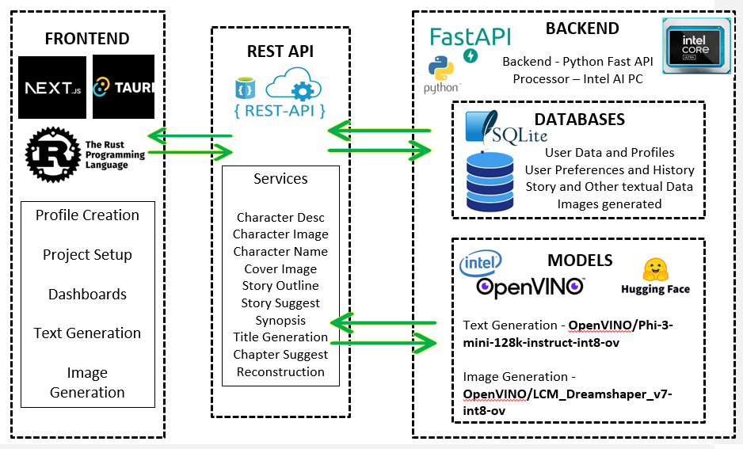

<div style="text-align: center;">
<div style=" display: flex; flex-direction: row; justify-items: center; align-items: center;">
    
    &nbsp;&nbsp;&nbsp;&nbsp;&nbsp;&nbsp;&nbsp;&nbsp;&nbsp;&nbsp;
    
</div>
<h1>HACKSTORM: INTEL® AI PC EDITION December 2024</h1>
<h3>
<a href="https://storyforge.hashnode.dev/storyforge-revolutionizing-writing-industry-with-ai-and-intel-technology">
    Blog Page Link
</a>
&nbsp;&nbsp;&nbsp;
<a href="https://youtu.be/rFUfj-23Vv8">
    YouTube Demo Video
</a>
&nbsp;&nbsp;&nbsp;
<a href="https://github.com/grittypuffy/storyforge">
    Github Repository Link
</a>
</h3>
<h1>StoryForge: Revolutionizing writing industry with AI and Intel® Technology</h1>
</div>

StoryForge is a client-side desktop application that leverages Intel® AI PC’s cutting-edge architecture and technologies which works offline to support novelists and writers by helping them with:
Analyzing the story for tone, emotion, structure, genres, etc.,
Generating Content – character names, descriptions, chapter suggestions, story titles, reconstructing the content based on needs, synopsis, outline, etc.,
Generating Images – character images based on description, cover image based on synopsis, etc.,

# Table of Contents

| **#** | **Section**                          |
|-------|--------------------------------------|
| 1     | [Problem Statement](#problem-statement) |
| 2     | [Solution Proposed](#solution-proposed) |
| 3     | [Architecture Diagram](#architecture-diagram) |
| 4     | [Technology Behind StoryForge](#technology-behind-storyforge) |
| 5     | [Features](#features)                |
| 6     | [Core Services](#core-services)      |
| 7     | [Development](#development)          |
| 8     | [Novelty](#novelty)                  |
| 9     | [Team](#team)                        |
| 10    | [Contributing](#contributing)        |


## Problem Statement

Writing a novel is a time-intensive, creative process that can overwhelm even seasoned writers.

**Challenges Include:**

- Crafting coherent narratives based on complex plots or storylines.
- Generating content that aligns with a given style, tone, or theme.
- Lack of visualization aids, such as images, which complement storytelling.
- Ensuring productivity and creativity when writer's block strikes.

There is a need for a solution that acts as a creative assistant, generating suggestions, maintaining coherence, and supplementing written content with visuals. This will empower writers to focus more on storytelling and less on repetitive or supplementary tasks.

## Solution Proposed

StoryForge is a client-side desktop application that leverages Intel® AI PC’s cutting-edge architecture and technologies which works offline to support novelists and writers by helping them by analyzing the story's tone, emotion, structure, and genre, while generating content such as character names, descriptions, chapter ideas, story titles, and synopses, along with creating visual assets like character illustrations and cover images based on the narrative.

## Architecture Diagram

<div></div>

## Technology Behind StoryForge

StoryForge combines state-of-the-art hardware and software innovations to deliver an exceptional user experience:

### Optimum Intel: Supercharging AI Workloads

Optimum Intel emerged as a critical library in our text and image generation projects. By fine-tuning AI model performance on Intel hardware, we dramatically reduced processing times for complex generative tasks. The library ensured our models ran efficiently, even on modest hardware configurations, enabling faster inference for product descriptions and creative artwork generation.

### Intel OpenVINO: Unleashing Hardware Potential

OpenVINO transformed our approach to model deployment. During our conversational AI project, we leveraged its optimization toolkit to run large language models more efficiently. The result was faster inference times and reduced computational overhead, making our AI assistant responsive and resource-friendly across different hardware environments.

### Python: The Backbone of Our AI Ecosystem

Python served as more than just a programming language—it was our universal translator between AI models, APIs, and user interfaces. In our recommendation engine, Python seamlessly integrated Hugging Face models, handled complex data transformations, and orchestrated the entire machine learning pipeline with remarkable flexibility.

### FastAPI: Rapid API Development

When building our real-time image generation service, FastAPI proved instrumental. Its asynchronous capabilities allowed handling multiple generation requests simultaneously, creating a smooth, responsive backend that could scale effortlessly. The automatic documentation feature significantly simplified integration for frontend developers.

### Poetry: Dependency Management Simplified

Poetry eliminated the complexities of dependency management. It ensured consistent environments across development, staging, and production stages. This was crucial in our multi-model machine learning platform, where library compatibility could determine the entire system's success.

### Tauri & Rust: Performance Meets Security

Our desktop AI tool required more than standard web technologies. Tauri and Rust provided a lightweight, secure framework capable of handling intensive AI computations. Rust's memory safety guaranteed a robust application without compromising performance, enabling complex AI tasks to run smoothly.

### Next.js: Crafting Interactive AI Interfaces

Next.js transformed our frontend development approach. Server-side rendering allowed us to build SEO-friendly interfaces for our AI-powered content generation platform. The framework ensured fast load times and smooth user interactions, critical for engaging AI-driven experiences.

### Tailwind CSS: Rapid UI Development

Tailwind CSS revolutionized our design workflow. In our AI assistant's interface, we could prototype and iterate design concepts at unprecedented speeds. Utility-first classes enabled consistent styling across complex, dynamic components without extensive custom CSS development.

### Hugging Face: Pre-trained Model Magic

Hugging Face became our primary source for pre-trained models. Whether handling sentiment analysis, text generation, or translation, their models dramatically reduced development time. Integration with Intel OpenVINO further enhanced model performance and efficiency.

### SQLite: Lightweight Local Storage

For our offline-first AI tools, SQLite provided an ideal data storage solution. User preferences, generation history, and model configurations were stored locally, ensuring data privacy and enabling seamless offline experiences across different device configurations.

### Intel® AI PC: Local AI Powerhouse

Intel's specialized AI hardware allowed a paradigm shift from cloud-dependent to local AI processing. Our text and image generation tools could now run entirely on-device, providing faster, more private AI experiences without constant internet connectivity and reducing latency in critical applications.
<div style="text-align: center;">
  
</div>
</br>

## Features

### Text Generation
Powered by OpenVINO and models like Phi-3-mini-128k-instruct-int8-ov, the tool excels in generating text that aligns with the writer’s style and story context.

### Image Generation
Using the LCM_Dreamshaper_v7-int8-ov model, StoryForge creates high-quality illustrations for characters, covers, and scenes, enhancing storytelling with vivid visuals.

## Core Services

| **Feature**             | **Functionality**                                                                 |
|--------------------------|-----------------------------------------------------------------------------------|
| Character Descriptions   | Helps define personalities and appearances for immersive character building.      |
| Character Images         | Generates visuals to match written character profiles.                           |
| Character Names          | Suggests names that fit the story’s tone and genre.                              |
| Cover Images             | Creates eye-catching designs based on the book’s synopsis.                       |
| Story Outlines           | Assists in planning the narrative structure.                                     |
| Story Suggestions        | Proposes ideas to keep the narrative engaging and coherent.                      |
| Synopses                 | Summarizes the plot to pitch to publishers or readers.                           |
| Title Generation         | Suggests compelling titles for novels.                                           |
| Chapter Suggestions      | Offers ideas to expand or refine story progression.                              |
| Story Reconstruction     | Revamps content for improved readability and alignment with the writer’s intent. |

---
# Development

## Structure

The project is structured as a monorepository with the following folders:

- `src`: Contains Next.js frontend source code.
- `src-tauri`: Contains Tauri specific configuration, handlers, and entry point for desktop application.
- `storyforge`: Backend containing entry point for FastAPI server.
- `tests`: Unit tests and integration tests for FastAPI server.

## Pre-requisites

Ensure you have the following dependencies installed on your system:

1. [Bun](https://bun.sh): Performant JavaScript runtime, bundler and dependency manager used for the frontend.
2. [Rust](https://www.rust-lang.org): Used for building cross-platform desktop application with Tauri. Install it via [`rustup`](https://www.rust-lang.org/learn/get-started)
3. [Poetry](https://python-poetry.org/): Packaging and dependency manager for Python, used for the FastAPI backend. It is assumed that you have Python installed on your system.

## Building the project

1. Clone the repository from GitHub

```shell
git clone https://github.com/grittypuffy/storyforge/
```

2. Install the needed dependencies

```shell
cd storyforge

poetry install # For installation of dependencies related to Python backend

bun install # Installs dependencies for frontend

cd src-tauri

cargo update # Updates the dependencies
```

3. Run the development build using `cargo tauri dev`

## Novelty

- Even though few AI tools for writing exists – they are majorly for informational writing rather than for writing stories, novels involving **creativity and generating images** for the same.

- Our novelty involves **support to novelists and story writers** in creating their characters, story places, reconstructing story lines, creating cover images, character images, character description, chapter wise suggestions, story reconstruction, etc.,

- Another novelty of our application is that it is not working on cloud and no data from the user is stored with us. Instead, it is being stored locally in the user’s device and hence it ensures **full privacy of user data**.

- It also runs completely **locally offline** on the user’s device which is **optimized** for Intel AI PC processors. Hence the user require no internet to work with our application.

# Team

### Team Name: Enigmatic Trios

#### Team Members:

- **Keerthana R**: [GitHub Profile](https://github.com/grittypuffy)
- **Arun Pranav A T**: [GitHub Profile](https://github.com/arunpranav-at)
- **Pooja Srikanth**: [GitHub Profile](https://github.com/Poojsri)

## Contributing

Fork the project, create a new branch and add your dependencies needed for the project, or make changes to the source file as needed.

Add dependencies for the build during development by the following commands:

- For Tauri: `cargo add <dependency-crate-name>`
- For Next.js frontend: `bun add <npm-dependency-name>`
- For Python backend: `poetry add <pypi-dependency-name>`. Ensure that you have the virtual environment activated for this to work. You can use `poetry shell` for activating it.

We welcome contributions and feedback from the community to enhance our document validation solution. Your insights are invaluable in shaping the future of this project.

- **Contributions**: We encourage developers to contribute code, documentation, and ideas to improve functionality and usability.
- **Feedback**: Please share your thoughts and experiences to help us identify areas for improvement and feature enhancements.
- **Issue Reporting**: If you encounter any issues, we invite you to raise them through our issue tracker, ensuring that we can address them promptly.

### **Note:**

SSR (Server-side Rendering) isn't supported in Tauri, so we use SSG (Static-Site Generation). [Check this blog post for more information regarding this](https://vercel.com/blog/nextjs-server-side-rendering-vs-static-generation)
